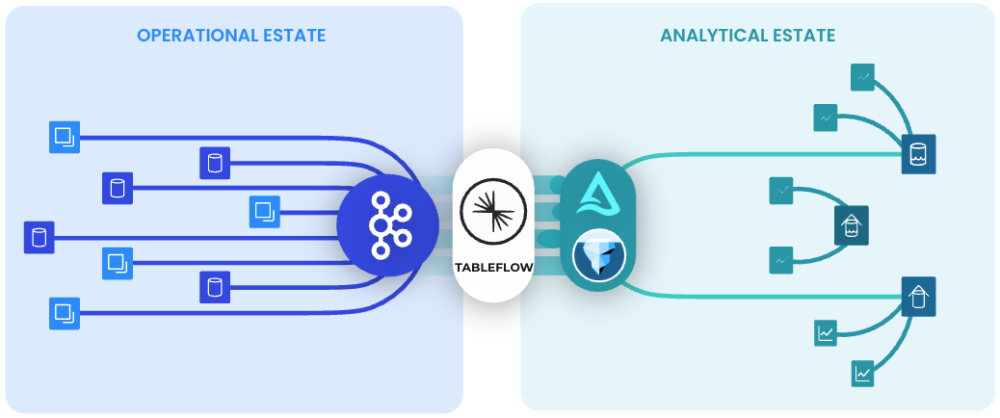
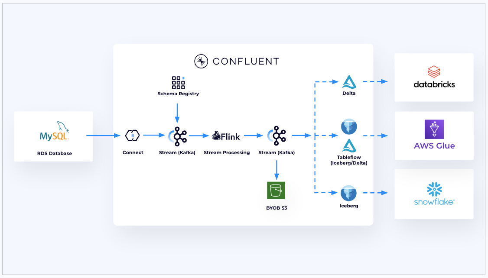

# Tableflow All In One

 

## **Agenda**
1. [Setup Prerequisites](#step-1)
2. [Project Initalization](#step-2)
3. [Set Credentials & Variables](#step-3)
4. [Deployment](#step-4)
5. [Add-On Setup](#step-5)
6. [Cleanup](#step-6)

 

## <a name="step-1"></a>Setup Prerequisites
Required tools :
  - `Terraform`
  - `Docker`

Credentials & Access:
  - `AWS Access Keys`
  - `Confluent Cloud API Keys (Confluent Cloud Resource Manager)`
  - `Snowflake ACCOUNTADMIN Dashboard Access`
  - `Databricks Console Access`

## <a name="step-2"></a>Project Initalization
  - Clone Source Code
    
    ```bash
    git clone https://github.com/confluentinc/global-scale-demos.git
    ```
  - Deployment options - use any one of the method - click to expand
    <details>
      <summary>Deploy All (default)</summary>
    
      ```bash
      cd global-scale-demos/oltp-to-olap/deploy-all
      ```
    </details>
    <details>
      <summary>Deploy only Snowflake for OLAP</summary>
    
      ```bash
      cd global-scale-demos/oltp-to-olap/deploy-all
      export TF_VAR_enable_olap_databricks=false
      export TF_VAR_enable_olap_glue=false
      ```
    </details>
    <details>
      <summary>Deploy only Databricks for OLAP</summary>
    
      ```bash
      cd global-scale-demos/oltp-to-olap/deploy-alone
      export TF_VAR_enable_olap_databricks=true
      ```
    </details>
    <details>
      <summary>Deploy only AWS Glue for OLAP</summary>
    
      ```bash
      cd global-scale-demos/oltp-to-olap/deploy-alone
      export TF_VAR_enable_olap_glue=true
      ```
    </details>

  - Initialize terraform and install required providers
    ```bash
    terraform init
    ```

## <a name="step-3"></a>Set Credentials & Variables
  ```bash

    # Update these variables
    
    #Required Always
    export TF_VAR_project_name="changeme-demo"
    export TF_VAR_confluent_cloud_api_key="<Confluent Cloud Resource Management API Key Name>"
    export TF_VAR_confluent_cloud_api_secret="<Confluent Cloud Resource Management API Key Secret>"
    export AWS_ACCESS_KEY_ID="<AWS User API Key ID>"
    export AWS_SECRET_ACCESS_KEY="<AWS User API Key Secret>"
    export AWS_SESSION_TOKEN="<AWS User Session Token>"
    export TF_VAR_aws_region="us-west-2"
    export TF_VAR_hardware="Aarch64"
    
    #Required when you are using Deploy All or Snowflake for OLAP 
    export TF_VAR_snowflake_organization_name="<Snowflake Organization Name>"
    export TF_VAR_snowflake_account_name="<Snowflake Account Name>"
    export TF_VAR_snowflake_username="<Snowflake Username>"
    export TF_VAR_snowflake_password="<Snowflake Password>"
    export TF_VAR_snowflake_role="ACCOUNTADMIN"
    
    #Required when you are using Deploy All or Databricks for OLAP 
    export TF_VAR_databricks_host="<Databricks Host URL>"
    export TF_VAR_databricks_client_id="<Databricks Service Principal Client ID>"
    export TF_VAR_databricks_client_secret="<Databricks Service Principal Client Secret>"
    export TF_VAR_databricks_ui_user="<Username of Databricks main user for ui access>"
  ```
> [!TIP]
> This project is built upon MAC / Aarch64 based configurations, if required you can set x86_64 as well.

## <a name="step-4"></a>Deployment
- Verify the resources
  ```bash
  terraform plan
  ```
- Deploy the resources
  ```bash
  terraform apply
  ```
> [!NOTE]
> This will take approx 10 minutes to deploy resources over AWS & Confluent

## <a name="step-5"></a>Add-on Setup
 
  Terraform will deploy almost everything, but still a few components should be managed via UI. 
  You can refer terraform output as well for next steps.

  Click to Expand

  <details>
      <summary>Confluent</summary>
      Terraform OLTP module will enable Tableflow for topic: low_stock_alerts with ICEBERG and DELTA format. If tableflow is not in sync or in failed state , you have to resume it. 
  </details>

  <details>
      <summary>Snowflake</summary>
      Tableflow will take some time to save snapshots in AWS s3 buckets, Approx 15 min.
      Once data is sinked, create iceberg table in snowflake. Refer terraform output
      Start queryinig the table.
  </details>

  <details>
      <summary>Glue</summary>
      Refer terraform output and start queryinig the table in AWS Athena.
  </details>

  <details>
      <summary>Databricks</summary>
      Databricks requires to update AWS IAM Role Trust Policy with the role's own ARN for Assume Role. 
      Update Trust Policy is updated based upon the terraform output. 
      Create the table in databricks SQL Workspace with table location in s3, Refer terraform output.
      Start queryinig the table.
  </details>


## <a name="step-6"></a>Cleanup
  ```bash
  terraform destroy 
  # Destroy again if any failures.
  ```
> [!WARNING]
> Snowflake catalog should be deleted via snowflake ui console.
